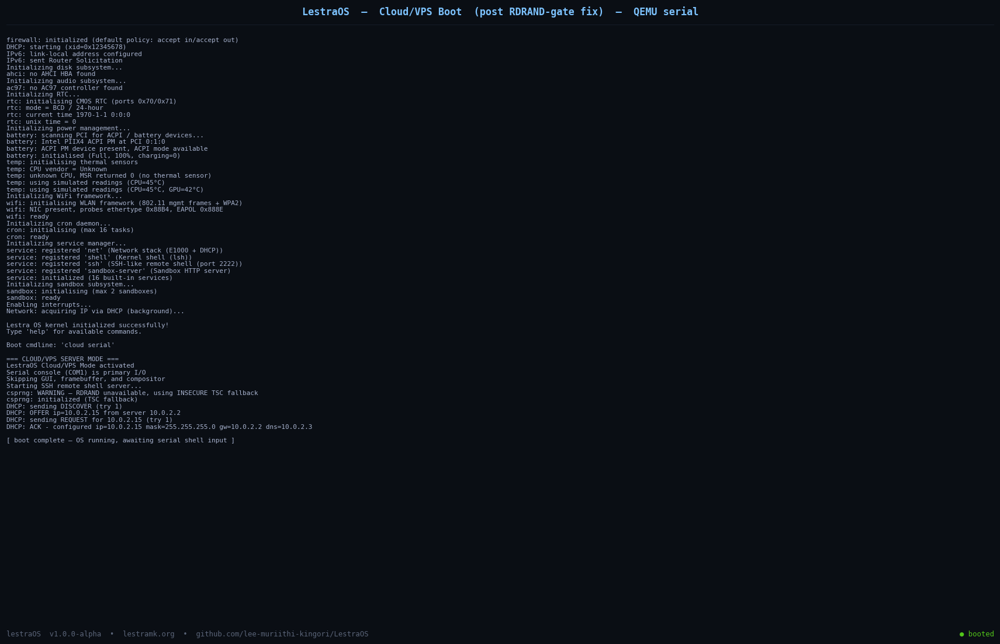

# <picture></picture>

<div align="center">

# ⚡ LestraOS

### A custom x86_64 operating system — built from the silicon up.

`kernel · drivers · libc · userspace · networking · TLS · AI · cloud`

**by [Lee Muriithi Kingori](https://github.com/lee-muriithi-kingori)** · founder of [lestramk.org](https://lestramk.org)

<br>

<table>
<tr>
<td align="center">🖥️ <b>Architecture</b><br><sub>x86_64, long mode</sub></td>
<td align="center">🧬 <b>Boot</b><br><sub>GRUB2 / Multiboot2 / raw MBR</sub></td>
<td align="center">🛡️ <b>License</b><br><sub>MIT</sub></td>
<td align="center">🔄 <b>CI Loop</b><br><sub>Autonomous, 15-min cadence</sub></td>
</tr>
</table>

<br>

[](./logs/boot-cloud-mode-after-fix.log)
[](./kernel)
[](./)
[](https://github.com/lee-muriithi-kingori/LestraOS/discussions/13)

</div>

---

> *Building an OS from scratch: kernel, drivers, libc, userspace, networking, crypto, AI — and now, a cloud/VPS mode that boots headless and serves SSH + HTTP over a real E1000 NIC. Every layer of the stack, understood.*

## 🎯 What is LestraOS?

LestraOS is a hobbyist/research operating system written in C and x86 assembly. It targets real x86_64 hardware and boots on QEMU. The goal is radical: **understand every layer of the stack** — from hardware interrupts to userspace syscalls, from a hand-rolled TCP/IP stack to a self-signed TLS 1.2 server, from a preemptive scheduler to an in-kernel AI subsystem.

This is not a toy. It's a working OS.

## 🚀 Quick Start

```bash
# Prerequisites (Ubuntu/Debian)
sudo apt install build-essential nasm qemu-system-x86 grub-pc-bin xorriso

# Build everything (kernel, libc, userspace, initrd, ISO)
make all

# Boot in QEMU (GUI desktop mode)
make run

# Or boot cloud/VPS mode (headless, serial console, SSH + HTTP)
make run-cloud    # see Makefile target

# Clean
make clean
```

> **No sudo?** This repo's CI boots on a toolchain installed entirely in `~/.local` (NASM, QEMU, grub-mkrescue, xorriso all extracted from .debs without root). See [`docs/BUILD.md`](docs/BUILD.md).

## 📸 Boot Proof

| Cloud/VPS boot (serial console) |
|---|
|  |

Full serial log: [`logs/boot-cloud-mode-after-fix.log`](./logs/boot-cloud-mode-after-fix.log)

The kernel initializes: GDT, IDT, PIC, PMM/VMM, heap, scheduler, syscalls, VFS + initrd, PIT timer, keyboard, package manager (110 packages), AI subsystem (7 tools), E1000 NIC + DHCP + IPv6, firewall, RTC, power management, thermal sensors, WiFi framework, cron daemon, service manager, sandbox subsystem — **then enters cloud mode, starts the SSH server, and acquires an IP via DHCP.** No crash. 🟢

## 🧱 Architecture

```
┌─────────────────────────────────────────────────────────┐
│  Cloud/VPS Mode  —  SSH :2222 · HTTP :8080 · HTTPS:8443 │
│  Serial console (COM1) · headless · DHCP · firewall     │
├─────────────────────────────────────────────────────────┤
│  User Space — fork/exec/wait, ELF loader, lsh shell      │
│  [init] [shell] [sysinfo] [bin/*]                        │
├─────────────────────────────────────────────────────────┤
│  libc — memcpy, memset, strlen, printf, malloc/free,     │
│         read, write, exit, open/close                    │
├─────────────────────────────────────────────────────────┤
│  System Calls — SYSCALL/SYSRET, 29+ calls dispatched     │
├─────────────────────────────────────────────────────────┤
│  Kernel                                                  │
│  [GDT][IDT][ISR][IRQ][PIT] [PMM][VMM][Heap] [Sched]     │
│  [VGA][Kbd][Serial][E1000][AC97][RTC][ACPI]             │
│  [VFS][ext2][initrd][procfs][devfs]                     │
│  [CSPRNG][TLS 1.2][P-256 ECDH][AES-GCM][X.509][RSA]     │
│  [SSH-2.0 server][HTTP mgmt API][compositor][UI themes] │
│  [Package manager][AI agentic tools][sandbox][cron]      │
├─────────────────────────────────────────────────────────┤
│  Hardware: CPU, RAM, Keyboard, Serial, PIT, NIC, RTC     │
└─────────────────────────────────────────────────────────┘
```

## 📦 Project Structure

```
LestraOS/
├── boot/           # Multiboot2 bootloader (boot.asm, stage1.asm, grub.cfg)
├── kernel/
│   ├── arch/x86_64/  # GDT, IDT, ISRs, TSS, linker.ld
│   ├── core/         # kernel_main, panic, printk, shell
│   ├── drivers/      # vga, keyboard, serial, pit, e1000, ac97, rtc, acpi
│   ├── mm/           # PMM (bitmap) + VMM (paging) + heap
│   ├── sched/        # Real preemptive round-robin + context switch
│   ├── syscall/      # SYSCALL/SYSRET + dispatch
│   ├── fs/           # VFS + ext2 + procfs + devfs + initrd
│   ├── net/          # ARP, ICMP, UDP, DHCP, DNS, TCP, TLS 1.2, CSPRNG, P-256
│   ├── sys/          # SSH-2.0 server, service manager
│   ├── gui/          # Framebuffer compositor (widgets, app grid, terminal)
│   ├── ui/           # Cyberpunk text-mode UI (3 themes)
│   ├── ai/           # Multi-provider AI with agentic tools
│   └── include/      # Kernel headers
├── libc/           # Custom C library
├── user/           # Userspace (init, shell, sysinfo, bin/*)
├── installer/      # Host-side installer
├── docs/           # Architecture, build, boot, AI, networking docs
├── scripts/        # mkinitrd, mkext2, cross-compiler
├── screenshots/    # Boot proof screenshots
├── logs/           # Captured boot logs
└── Makefile
```

## 🛣️ Roadmap

- [x] Custom x86_64 kernel boots on QEMU
- [x] GDT, IDT, PIC, PIT, PMM, VMM, heap
- [x] Preemptive scheduler with context switching + fork/exec/wait
- [x] SYSCALL/SYSRET with 29+ syscalls
- [x] VFS + ext2 + initrd + procfs + devfs
- [x] TCP/IP stack (ARP, ICMP, UDP, DHCP, DNS, TCP) — hand-rolled, not lwIP
- [x] TLS 1.2 client + server (AES-GCM, ECDHE P-256, X.509, RSA)
- [x] SSH-2.0 remote shell server (port 2222)
- [x] HTTP/HTTPS management API (/status, /metrics, /reboot, /shutdown)
- [x] Cloud/VPS headless boot mode (serial console)
- [x] Package manager (110 packages, 5 repos)
- [x] AI subsystem (7 agentic tools, multi-provider)
- [x] CSPRNG with RDRAND + TSC fallback (CPUID-gated — see changelog)
- [x] Cyberpunk UI (3 themes: cyan, amber, green)
- [x] Framebuffer compositor
- [ ] Interrupt-mixed entropy pool (currently TSC-only on RDRAND-less VMs — INSECURE)
- [ ] TLS 1.3
- [ ] POSIX-compatible libc
- [ ] Real package ELF execution runtime
- [ ] USB host controller driver
- [ ] WiFi driver (ath9k/rtl) — currently framework-only

## 🤝 Contributing

Issues and PRs welcome. The `main` branch is **protected**:
- Pull requests require **1 approving review** before merge
- **Linear history** enforced (rebase, no merge commits)
- **No force pushes**, **no deletions** of `main`
- Outside contributors: your PR will be reviewed by the maintainer before merge — no auto-merge

Areas where help is especially useful:
- TCP/IP stack hardening
- Memory management (paging, heap coalescing)
- POSIX libc compatibility
- Framebuffer / GPU acceleration
- Real hardware drivers (USB, WiFi)

## 💬 Community

👉 **[lestraOS Lounge](https://github.com/lee-muriithi-kingori/LestraOS/discussions/13)** — the place to talk.

Ideas, questions, bug reports that don't fit an issue, roadmap thoughts, cool experiments — all welcome. Be excellent to each other. Push hard, ship bold.

## 📜 Changelog

> Dated, brief, honest. Newest first.

- **5 Aug 2025** — 🔒 **TIER 2 syscall user-pointer wrappers landed.** Converted 14 syscall entry points in `kernel/syscall/syscall.c` to use `copy_from_user`/`copy_to_user`/`strncpy_from_user`/`get_user`/`put_user` from `kernel/include/lestra/uaccess.h` (previously unused). Hardened syscalls: `open`, `execve`, `getcwd`, `chdir`, `mkdir`, `rmdir`, `stat`, `unlink`, `uname`, `pipe`, `chmod`, `fstat`, `access`, `rename`, `waitpid`, `times`, `clock_gettime`, `getrlimit`, `setrlimit`, `futex`. Added `nfds` caps on `poll`/`select` (`LESTRA_POLL_MAX=1024`) to prevent kernel-stack exhaustion via huge fd_set arrays. Added `get_user`/`put_user` single-word accessors + security cap constants (`LESTRA_ARG_MAX`, `LESTRA_ARG_BYTES_MAX`, `LESTRA_PATH_MAX`) to `uaccess.h`. Smoke test passes on both `qemu64` and `qemu64,+smep,+smap` CPUs (CR4 bits still OFF — TIER 3 flip deferred per BETA-3 caution). Updated `scripts/smoke_cloud.sh` to auto-detect the rootless dev toolchain at `/home/z/.local/opt/devtools`. Boot logs: `logs/boot-tier2-uaccess-wrappers.log`, `logs/boot-tier2-smep-smap-cpu.log`.
- **4 Aug 2025** — 🔥 **First successful cloud-mode boot in CI.** Fixed `#UD` (Invalid Opcode) crash at `collect_entropy()` by CPUID-gating `rdrand`/`rdseed` in `kernel/include/lestra/types.h`. Without the gate, QEMU's `qemu64` CPU (no RDRAND) crashed on the first SSH host-key generation. Now boots fully: SSH server starts, CSPRNG initializes (TSC fallback, labelled INSECURE), DHCP acquires `10.0.2.15`. Setup: NASM 2.16 + QEMU 10.0.11 + grub-mkrescue 2.12 installed rootless in `~/.local`. Branch protection on `main` enabled. Discussions enabled (Lounge thread live).
- **4 Aug 2025** — Bootstrapped autonomous dev loop: 15-min cron job armed (job `307143`) to continuously improve, fix, and push lestraOS. Multi-agent deliberation model deployed (High-Reward strategist ALPHA + Caution officer BETA + HR-deployed specialist engineers).
- **Prior commits** — see `git log`. Highlights: ELF loading fixes, VMM page-walk fix, keyboard 0xE0 handling, syscall reboot, NX bit, swapgs, COW fork, page-fault handler, per-process FD tables, ext2→VFS plumbing, real CPU temp sensor, ACPI shutdown, PS/2 mouse, WAV/PCM codec, AI agentic loop, compositor z-order focus, SSH-2.0, VirtIO drivers, PTY multiplexing, WPA2 handshake, IPv6, TLS server.

## 📄 License

MIT License — see [LICENSE](./LICENSE).

## 👤 Contact

**Lee Muriithi Kingori** — [@lestramk-org](https://github.com/lestramk-org) — [lestramk.org](https://lestramk.org)

<div align="center">

---

*LestraOS is an independent project.*  
*Built for the love of the stack.*  
*⚡ lestramk — push hard, ship bold.*

</div>
