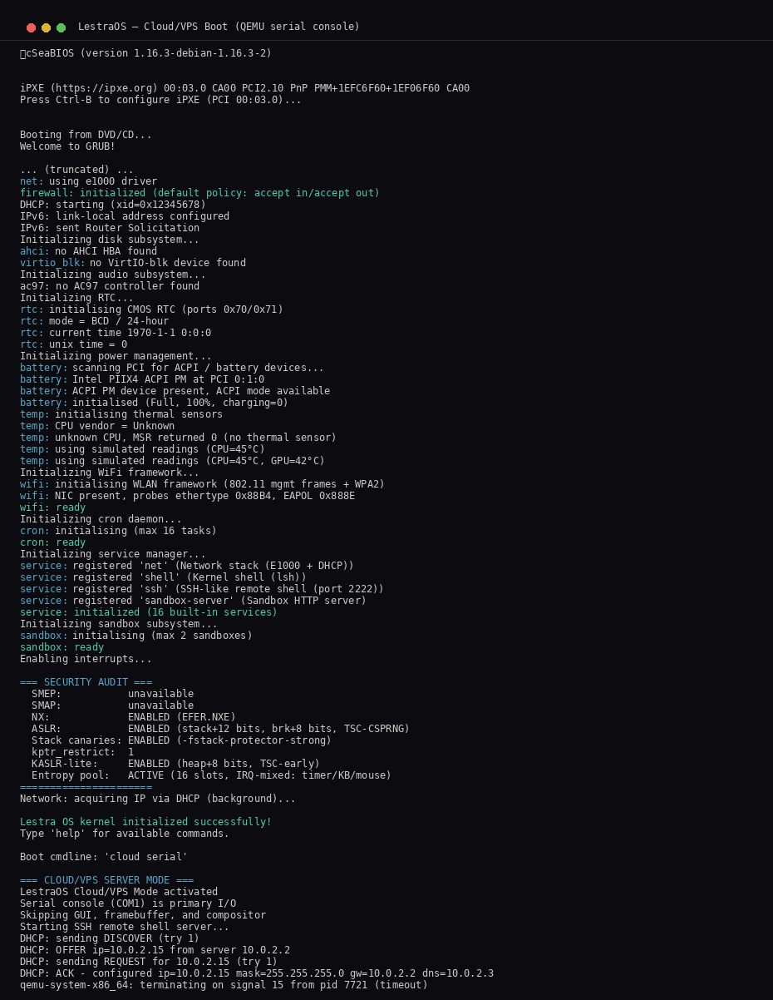
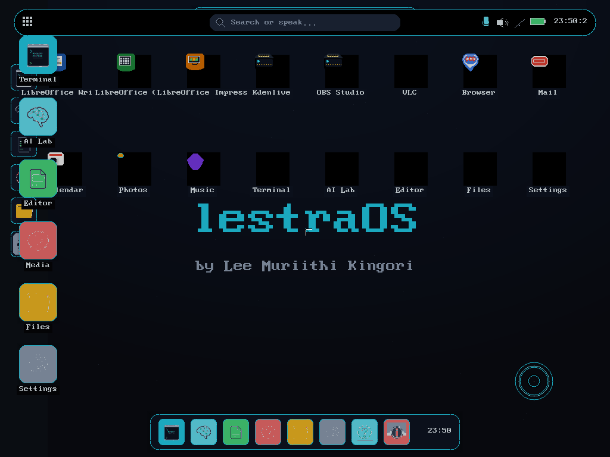
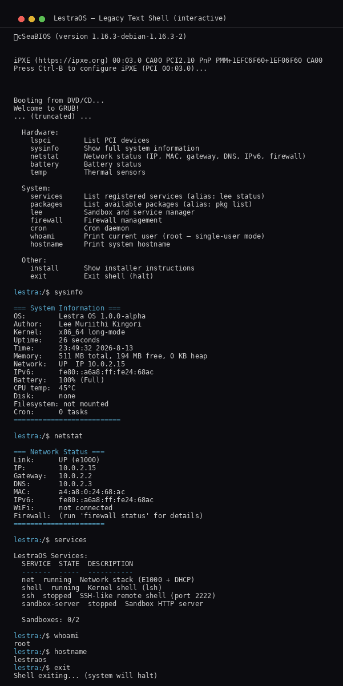

# LestraOS

### A custom x86_64 operating system — built from the silicon up.

`kernel · drivers · libc · userspace · networking · TLS · crypto · AI · GUI · cloud`

**by [Lee Muriithi Kingori](https://github.com/lee-muriithi-kingori)** · founder of [lestramk.org](https://lestramk.org)

<div align="center">


</div>

| | |
|---|---|
| Architecture | x86_64, long mode |
| Boot | GRUB2 / Multiboot2 / raw MBR |
| License | MIT |
| Source | ~40,000 lines C + x86 assembly |
| Syscalls | 67 (0–66, Lestra ABI — see `kernel/include/lestra/syscall.h`) |
| Drivers | 18 (E1000, RTL8139, VirtIO-net, VirtIO-blk, AHCI, AC97, PS/2, serial, PCI, RTC, PIT, HPET, battery, temp) |
| Filesystems | ext2, FAT32, procfs, devfs, tmpfs, tarfs |
| Networking | Hand-rolled TCP/IP stack, TLS 1.2, SSH-2.0, HTTP/HTTPS server |
| GUI | 42-file framebuffer compositor, 60Hz, 16 apps |
| AI | In-kernel GGUF inference engine (pickle) + cloud API chat |
| Security | SMEP, SMAP, NX, ASLR (~36 bits), stack canaries, KASLR-lite, entropy pool |

---


*Meet the Yugi family — LestraOS booting on real hardware.*

---

> *Every layer of the stack, understood — from hardware interrupts to userspace syscalls, from a hand-rolled TCP/IP stack to a self-signed TLS 1.2 server, from a preemptive scheduler to an in-kernel AI subsystem.*

## What is LestraOS?

LestraOS is a hobbyist/research operating system written in C and x86 assembly. It targets real x86_64 hardware and boots on QEMU. The goal is radical: **understand every layer of the stack**.

This is not a toy. It boots, initializes every subsystem, gets a DHCP lease, and drops to an interactive shell. It has a real TCP/IP stack, TLS 1.2, SSH server, a 42-file GUI compositor, and an in-kernel GGUF inference engine.

## Boot Proof

### Cloud/VPS mode (serial console)

Real QEMU serial output — kernel initializes GDT, IDT, PMM/VMM, heap, scheduler, syscalls, VFS, PIT, keyboard, PCI, E1000 NIC + DHCP (10.0.2.15), firewall, cron, services, sandbox, security audit, then enters cloud mode and starts the SSH server.



### GUI mode (framebuffer compositor)

1024x768 framebuffer — compositor starts with the cyberpunk-cyan theme, renders splash animation, app grid, and top bar.



### Legacy text shell

Interactive shell with `help`, `sysinfo`, `netstat`, `services`, `whoami`, `hostname`.



## Quick Start

```bash
# Prerequisites (Ubuntu/Debian)
sudo apt install build-essential nasm qemu-system-x86 grub-pc-bin xorriso

# Clone
git clone https://github.com/lee-muriithi-kingori/LestraOS.git
cd LestraOS

# Build everything
make all

# Boot (GUI desktop)
make run

# Boot (cloud/serial mode — headless, SSH + HTTP)
make run-cloud
```

## Architecture

```
┌──────────────────────────────────────────────────────────────�
│  Cloud/VPS Mode  —  SSH :2222 · HTTP :8080 · HTTPS :8443    │
│  Serial console (COM1) · headless · DHCP · firewall          │
├──────────────────────────────────────────────────────────────┤
│  User Space — fork/exec/wait, ELF loader, lsh shell          │
│  [init] [shell] [sysinfo] [hello]                            │
├──────────────────────────────────────────────────────────────┤
│  libc — memcpy, memset, strlen, printf, malloc/free,         │
│         read, write, open/close, fork, execve, mmap          │
├──────────────────────────────────────────────────────────────┤
│  System Calls — SYSCALL/SYSRET, 67 calls dispatched (0–66)  │
│  Lestra ABI (0=exit, 2=read, 3=write — see syscall.h)        │
├──────────────────────────────────────────────────────────────┤
│  Kernel                                                      │
│  [GDT][IDT][ISR][IRQ][PIT] [PMM][VMM][Heap] [Scheduler]     │
│  [SMEP][SMAP][NX][ASLR][canaries][KASLR-lite][entropy pool]  │
│  [VGA][PS/2 kbd+mouse][Serial 16550][RTC][ACPI][PCI]         │
│  [E1000][RTL8139][VirtIO-net][VirtIO-blk][AHCI][AC97]        │
│  [VFS][ext2][FAT32][procfs][devfs][tmpfs][tarfs]             │
│  [AES-128-GCM][SHA-256][HMAC][P-256 ECDHE][RSA-2048]        │
│  [X.509][TLS 1.2 client+server][AES-256-CTR DRBG][CSPRNG]   │
│  [SSH-2.0 server][HTTP mgmt API][sandbox server]             │
│  [42-file compositor][16 apps][3 themes][animations]          │
│  [Package manager][AI chat][pickle GGUF inference]            │
│  [cron][service manager][firewall][ad-blocker]                │
├──────────────────────────────────────────────────────────────┤
│  Hardware: CPU, RAM, Keyboard, Mouse, Serial, PIT, NIC,      │
│            RTC, SATA/AHCI, Audio (AC97), Temperature          │
└──────────────────────────────────────────────────────────────┘
```

## Kernel

### Memory Management
- **PMM** — Bitmap physical page allocator, 4KB pages, refcount array for COW
- **VMM** — PML4/PDPT/PD/PT page tables, `mmap`/`munmap`, 8-bit ASLR slide
- **Heap** — Kernel heap with KASLR-lite (TSC-based entropy, 64-256 MB range)
- **Page fault handler** — COW, auto-growing stack, demand paging
- **Dynamic metadata protection** (KE-35) — PMM bitmap marked non-present after init

### Scheduler
- Preemptive round-robin, up to 32 processes
- `fork()` with deep copy + COW, `exec()`, `wait4()`, `vfork()`
- Full signal delivery (rt_sigaction, kill, rt_sigprocmask, rt_sigreturn)
- Signal trampoline in userspace for handler return
- Timer-based `task_sleep()` with wake deadlines
- Context switch saves/restores all 15 GPRs + segments + RFLAGS

### Syscalls (67 total — `kernel/include/lestra/syscall.h`, 0–66)

| # | Syscall | # | Syscall | # | Syscall |
|---|---------|---|---------|---|---------|
| 0 | exit | 23 | pipe | 46 | connect |
| 1 | fork | 24 | kill | 47 | listen |
| 2 | read | 25 | rt_sigaction | 48 | accept |
| 3 | write | 26 | rt_sigprocmask | 49 | send |
| 4 | open | 27 | rt_sigreturn | 50 | recv |
| 5 | close | 28 | dup2 | 51 | poll |
| 6 | waitpid | 29 | unlink | 52 | select |
| 7 | execve | 30 | chmod | 53 | dup |
| 8 | getpid | 31 | fstat | 54 | fcntl |
| 9 | brk | 32 | access | 55 | truncate |
| 10 | mmap | 33 | rename | 56 | ftruncate |
| 11 | munmap | 34 | ioctl | 57 | chown |
| 12 | gettimeofday | 35 | getuid | 58 | symlink |
| 13 | sleep | 36 | getgid | 59 | link |
| 14 | getcwd | 37 | getppid | 60 | readlink |
| 15 | chdir | 38 | setuid | 61 | chroot |
| 16 | mkdir | 39 | times | 62 | fchdir |
| 17 | rmdir | 40 | clock_gettime | 63 | umask |
| 18 | stat | 41 | getrlimit | 64 | setpriority |
| 19 | lseek | 42 | setrlimit | 65 | getpriority |
| 20 | getdents | 43 | futex | 66 | nice |
| 21 | reboot | 44 | socket | | |
| 22 | uname | 45 | bind | | |

### ELF Loading
- Static ELF64 loader: parses headers, maps PT_LOAD segments, jumps to ring 3 via IRETQ
- Dynamic linker (`ldso.c`, 1067 lines): parses PT_INTERP/PT_DYNAMIC, loads DT_NEEDED recursively, symbol resolution, relocations (RELATIVE, 64, GLOB_DAT, JUMP_SLOT), runs DT_INIT_ARRAY
- Linux ELF compatibility layer (`linux_compat.c`): 50+ Linux syscall number translations
- PE/COFF loader (`pe.c`): Windows EXE support — loads PE32+ x86_64 executables
- Deep copy + huge page split for user address space (KE-13)
- Per-process page tables with SMEP/SMAP isolation

### Security

| Protection | Status | Details |
|------------|--------|---------|
| SMEP | Enabled | CR4 bit 20 — kernel can't execute userspace pages |
| SMAP | Enabled | CR4 bit 21 — kernel can't access userspace data |
| NX | Enabled | EFER.NXE — no-execute bit on pages |
| ASLR | ~36 bits | Stack 12-bit, brk 8-bit, heap 8-bit, mmap 8-bit |
| Stack canaries | Enabled | `-fstack-protector-strong` on all kernel code |
| KASLR-lite | Enabled | Heap base randomized (64-256 MB, 8 bits) |
| Entropy pool | Active | 16-slot lock-free XOR accumulator, timer/KB/mouse IRQ + RDSEED |
| CSPRNG | Active | AES-256-CTR DRBG, 1MB reseed interval |
| Syscall rate limit | Active | 1000 calls/ms per process |
| Fork bomb detection | Active | Max 8 children per process |
| kptr_restrict | 1 | Kernel pointers hidden from userspace |

## Drivers

### Network (3 NIC drivers, unified vtable)
| Driver | Type | Transport | Status |
|--------|------|-----------|--------|
| Intel E1000 | MMIO | PCI | Full TX/RX rings |
| Realtek RTL8139 | IO-port | PCI | RX buffer + TX descriptors |
| VirtIO-net | MMIO/IO-port | PCI | Legacy (0.9.5) + modern (1.0) |

### Storage
| Driver | Type | Status |
|--------|------|--------|
| VirtIO-blk | MMIO/IO-port | Full read/write, 3-descriptor chain |
| AHCI (SATA) | MMIO | Read sectors (write not yet implemented) |

### Audio
| Driver | Status |
|--------|--------|
| AC97 playback | Full PCM via buffer descriptor lists |
| AC97 capture | Mic input, 8x4KB BD ring buffer |

### Input
| Driver | Status |
|--------|--------|
| PS/2 keyboard | Scancode set 1, shift/ctrl/alt/capslock, circular event buffer |
| PS/2 mouse | Intellimouse (scroll wheel), 4-byte packets, /dev/mouse |

### Other
| Driver | Status |
|--------|--------|
| Serial (16550) | COM1, IRQ-driven receive |
| PCI bus | Type 1 config, BAR decoding, `pci_find_device/class` |
| PIT timer | Configurable frequency, feeds scheduler + network + cron + entropy |
| RTC | Real-time clock, read via CMOS |
| ACPI | RSDP/RSDT/XSDT walking, MADT/HPET/FACP parsing, S5 shutdown |
| Battery | PIIX4 detection, simulated for QEMU |
| Temperature | Real MSR readings (Intel/AMD), TjMax lookup table |

## Filesystem

| FS | Capabilities |
|----|-------------|
| **ext2** | 1080 lines. Superblock, block groups, inode read/write, direct+indirect blocks, create/delete, 256KB file cache |
| **FAT32** | 742 lines. Read+write, cluster allocation, dual-FAT mirror, directory modification |
| **procfs** | `/proc/meminfo`, `cpuinfo`, `ps`, `version`, `self/exe`, `self/maps`, `uptime`, `loadavg`, `kmsg`, `cmdline`, `interrupts`, `mounts` |
| **devfs** | `/dev/null`, `zero`, `urandom` (xorshift128), `tty`, `mouse` |
| **tmpfs** | In-memory volatile filesystem, lost on reboot |
| **tarfs** | Read-only rootfs from initrd, POSIX ustar, symlink resolution |

## Networking

### TCP/IP Stack (hand-rolled, no lwIP)
- **Ethernet II** — Frame send/receive, MAC filtering
- **ARP** — Request/reply/cache, gratuitous ARP
- **IPv4** — Header parsing, checksum, routing
- **ICMP** — Echo request/reply (ping)
- **UDP** — Send/receive, checksum
- **DHCP** — Full 4-step (DISCOVER/OFFER/REQUEST/ACK), lease renewal
- **DNS** — A record queries, nameserver config
- **TCP** — Multi-connection: SYN/SYN-ACK/ACK/FIN, sequence numbers, retransmission timer, 1024-byte window

### TLS 1.2
- AES-128-GCM encryption
- SHA-256 hashing
- HMAC-SHA256 MAC
- P-256 ECDHE key exchange (392 lines: modular arithmetic, affine point add/double, scalar multiplication)
- X.509 v3 DER certificate parsing (480 lines)
- RSA-2048 PKCS#1 v1.5 verification (256-byte big-endian, schoolbook multiply)
- Self-signed certificate generation for server mode
- Embedded root CA store with real RSA modulus values

### SSH-2.0 Server
- ECDH key exchange
- AES-128-GCM encryption
- Password authentication
- PTY allocation and terminal I/O
- Runs on port 2222 in cloud mode

### HTTP/HTTPS Server
- VFS file serving
- Cloud management API: `GET /status`, `GET /metrics`, `POST /reboot`, `POST /shutdown`
- JSON response output
- Rate limiting

### Other
- **Firewall** — Stateless packet filter, per-direction rules, first-match wins
- **Ad-blocker** — DNS-level blocklist (~30 domains), returns 0.0.0.0
- **WiFi framework** — 802.11 beacon/probe scan, WPA2 4-way handshake, PBKDF2 (framework only — no real WiFi driver yet)

## GUI (42 files, 60Hz compositor)

### Compositor
- Widget system with draggable windows
- Desktop icons, top bar, app grid, dock, left drawer
- Overlay management (lock screen, power menu, screenshot, clipboard, shortcuts, context menu, brightness, volume)
- 24-slot animation engine with 5 easing functions (integer-only fixed-point)

### Apps (16)
| App | Description |
|-----|-------------|
| Terminal | 358-line GUI terminal, 256-line scrollback, embedded kernel shell I/O |
| Terminal Tabs | 8 tabs, Ctrl+Shift+T new, Ctrl+W close, Ctrl+Tab switch |
| Editor | 461-line text editor, line-based buffer, cursor, insert/delete, Ctrl+S save |
| Editor Pro | 530-line, C syntax highlighting, line numbers, Ctrl+F search |
| Media Player | 804-line, WAV/PCM codec (8/16-bit, mono/stereo, 8-48kHz), AC97 playback |
| File Explorer | 674-line two-pane manager, sidebar, VFS-backed, context menu |
| AI Lab | 245-line chat UI, message bubbles, provider indicator |
| Weather | 352-line, wttr.in fetch, pixel-art icons, 3-day forecast |
| CPU Monitor | 243-line, 60-sample line graph, core count/frequency |
| Network Monitor | 213-line, IP/MAC/Gateway/DNS display, 60-sample speed graph |
| System Info | 196-line, OS version, CPU, RAM, IP, disk |
| Task Manager | 316-line, PID/Name/State/CPU%/Mem table, End Task |
| Clock | 236-line, digital + analog faces, 12/24h toggle |
| Settings | 362-line, 2-pane, Display/Sound/Network/Personalization/Apps/Accounts/About |
| App Store | 290-line, search, categories, install/uninstall |
| Photos | RGB888 image display |

### UI System
- 3 themes (cyberpunk cyan, amber, green) with dark/light variants
- 10 accent colors, persisted to `/etc/theme`
- 6 gradient wallpapers, persisted to `/etc/wallpaper`
- Glassmorphism cards, soft shadows, rounded corners
- Dynamic island (8 activity states, priority queue, morphing)
- Toast notifications (slide-in, auto-dismiss)
- On-screen keyboard (QWERTY, sticky Shift/Ctrl/Alt)
- Brightness flyout, volume slider with mute toggle
- Global shortcuts (Alt+Tab, Alt+F4, Super, Escape)

## AI Subsystem

### Pickle (in-kernel GGUF inference engine)
- From-scratch GGUF v3 parser: header/metadata/tensor parsing
- Dequantization: F32, F16, Q8_0, Q4_0, Q4_1, Q5_0, Q5_1, Q4_K, Q5_K, Q6_K, Q8_K, Q2_K, Q3_K
- Llama-family forward pass: RMSNorm, GQA attention with RoPE, SwiGLU FFN, output projection
- Greedy + temperature sampling
- Software IEEE-754 math library (379 lines): add/sub/mul/div, exp, tanh, sigmoid, silu, gelu, sqrt — integer-only, no FPU needed
- Boot-time selftest with embedded 4KB demo GGUF

### Cloud AI Chat
- HTTP POST to provider APIs (GLM 5.2, Claude, Gemini, OpenAI)
- TLS for HTTPS endpoints
- Response parsing
- Shell commands: `ai`, `claude`, `glm`, `gemini`, `openai`, `uai`

### Offline AI
- Rule-based keyword matcher (honest — not a neural model)

## Audio / Speech

### TTS (Text-to-Speech)
- 256-line formant synthesis
- ~20 phonemes, formant frequencies
- LFSR noise generator, sin lookup table
- AC97 PCM playback at 22050 Hz

### STT (Speech-to-Text)
- 571-line on-device recognition
- AC97 mic capture
- VAD via RMS energy
- 16-bin log-magnitude DFT
- DTW against ~25-word lexicon
- No cloud dependency

## Package Manager

- 5 repos, 128 max packages, 32 max installed
- Install/remove/search/update with dependency tracking
- 110 packages across 5 repos (LibreOffice, Kdenlive, OBS, etc.)
- .deb package support: install/extract Debian packages
- Shell commands: `pkg install`, `pkg list`, `pkg search`, `pkg deb install`

## Userspace

### Custom C Library
- `stdio.c` — FILE* layer, fopen/fclose/fread/fwrite, printf family, stdin/stdout/stderr
- `unistd.c` — POSIX wrappers: open/close/read/write/lseek/dup/dup2/pipe/fork/execve/waitpid/getpid/chdir/getcwd/mmap/munmap/brk/sleep/usleep
- `string.c` — memset, memcpy, memmove, memcmp, strcmp, strlen, strcpy, strcat, strchr, strstr
- `stdlib.c` — malloc/free (first-fit + free list + coalescing), sbrk, atoi, qsort, rand/srand
- `errno.c` — Global errno, strerror (30+ strings), perror

### Programs
- **init** — PID 1, ASCII banner, boot stages display, fork() test, execve("/shell")
- **shell (lsh)** — 678 lines, 23 builtin commands, pipe support (`|`), background jobs (`&`)
- **sysinfo** — CPU vendor/model via CPUID, feature detection (FPU/TSC/MSR/MMX/SSE/LM)
- **hello** — Test program: writes "Hello from userspace!"

### Shell Commands
| Category | Commands |
|----------|----------|
| System | `help`, `sysinfo`, `neofetch`, `uname`, `version`, `uptime`, `whoami`, `hostname`, `exit` |
| Process | `ps`, `free`, `cpuinfo`, `meminfo`, `reboot`, `shutdown` |
| Network | `netstat`, `ifconfig`, `network`, `ping`, `ping6`, `wget`, `firewall` |
| Files | `file` (ls/mkdir/cat/cp/mv/rmdir/rm/chmod/stat), `mount`, `save`, `exec` |
| Hardware | `lspci`, `battery`, `temp`, `wifi`, `disk` |
| Services | `services`, `lee` (service manager + sandbox), `cron` |
| Packages | `packages`, `pkg` (install/list/search), `pkg deb` (install/list/remove .deb packages) |
| AI | `ai`, `claude`, `glm`, `gemini`, `openai`, `uai` |
| UI | `ui`, `theme`, `clear`, `date`, `time`, `play`, `speak` |

## Cloud/VPS Mode

LestraOS can boot headless as a VPS/cloud server:
- Serial console (COM1)
- DHCP auto-configuration
- SSH server on port 2222
- HTTP management API on port 8080
- HTTPS sandbox server on port 8443
- Firewall with configurable rules
- Cron daemon for scheduled tasks
- Service manager with auto-restart

## Project Structure

```
LestraOS/
├── boot/                  # Bootloader (stage1.asm, boot.asm, grub.cfg)
├── kernel/
│   ├── arch/x86_64/       # GDT, IDT, ISRs, TSS, framebuffer, linker.ld
│   ├── core/              # kernel_main, panic, printk, shell, userspace_boot
│   ├── mm/                # PMM (bitmap) + VMM (paging) + heap + page_fault
│   ├── sched/             # Preemptive round-robin + context switch (asm)
│   ├── syscall/           # SYSCALL/SYSRET + dispatch (67 calls, 0–66)
│   ├── exec/              # ELF loader, dynamic linker, signals, futex, pipe, TLS
│   ├── drivers/
│   │   ├── char/          # serial, keyboard, mouse, pty, timer
│   │   ├── block/         # virtio_blk, ahci
│   │   ├── net/           # e1000, rtl8139, virtio_net
│   │   ├── audio/         # ac97, ac97_capture
│   │   ├── pci/           # PCI bus enumeration
│   │   ├── power/         # battery
│   │   ├── sensor/        # temperature
│   │   └── apic/          # Local APIC, IOAPIC
│   ├── fs/                # VFS, ext2, FAT32, procfs, devfs, tmpfs, tarfs
│   ├── net/               # TCP/IP stack, TLS 1.2, SSH, HTTP, firewall, wifi
│   ├── gui/               # 42-file compositor (terminal, editor, media, etc.)
│   ├── ui/                # Cyberpunk text-mode UI (3 themes)
│   ├── ai/                # Pickle GGUF engine, cloud AI chat, offline AI
│   ├── audio/             # TTS (formant synthesis), STT (DTW lexicon)
│   ├── sys/               # SSH server, service manager, cron, sandbox
│   ├── acpi/              # ACPI discovery (RSDP/RSDT/XSDT/MADT/S5)
│   ├── pkg/               # Package manager, AI CLI, preinstalled catalog
│   └── include/           # Kernel headers + embedded assets (icons, wallpaper)
├── libc/                  # Custom C library (stdio, unistd, string, stdlib, errno)
├── user/                  # Userspace (init, shell, sysinfo, hello)
├── third_party/           # Submodules (lestramanika — GGUF inference engine)
├── docs/                  # Architecture, build, boot, AI, networking docs
├── scripts/               # mkinitrd, mkext2, cross-compiler
├── screenshots/           # Real boot screenshots (3 modes + hardware)
└── Makefile               # 497-line build system
```

## Roadmap

- [x] Custom x86_64 kernel boots on QEMU + real hardware
- [x] GDT, IDT, PIC, PIT, PMM, VMM, heap
- [x] Preemptive scheduler with fork/COW/exec/wait
- [x] 67 syscalls (0–66, Lestra ABI)
- [x] ELF64 loader + dynamic linker (ldso)
- [x] VFS + ext2 + FAT32 + procfs + devfs + tmpfs + tarfs
- [x] Hand-rolled TCP/IP stack (ARP, ICMP, UDP, DHCP, DNS, TCP)
- [x] TLS 1.2 client + server (AES-GCM, ECDHE P-256, X.509, RSA-2048)
- [x] SSH-2.0 remote shell server (port 2222)
- [x] HTTP/HTTPS management API (/status, /metrics, /reboot, /shutdown)
- [x] Cloud/VPS headless boot mode
- [x] Package manager (110 packages, 5 repos)
- [x] In-kernel GGUF inference engine (pickle) with software FPU
- [x] CSPRNG (AES-256-CTR DRBG + RDRAND + RDSEED + IRQ entropy pool)
- [x] Security: SMEP, SMAP, NX, ASLR (~36 bits), canaries, KASLR-lite
- [x] 42-file framebuffer compositor (60Hz, 16 apps, 3 themes)
- [x] AC97 audio playback + capture
- [x] TTS (formant synthesis) + STT (on-device DTW)
- [x] Linux ELF binary compatibility layer
- [x] COW fork + auto-growing stack + demand paging
- [x] HPET high-resolution timer (nanosecond clock + µs delays, PIT stays tick source)
- [ ] USB host controller (XHCI/UHCI/EHCI)
- [ ] WiFi driver (ath9k/rtl) — framework exists, no real driver
- [ ] NVMe storage
- [ ] Intel HD Audio (HDA)
- [ ] SMP (symmetric multiprocessing)
- [ ] TLS 1.3
- [ ] POSIX-complete libc

## Acknowledgements

Built by [Lee Muriithi Kingori](https://github.com/lee-muriithi-kingori). Every line is written from scratch — no vendored kernel code. The [lestramanika](https://github.com/lee-muriithi-kingori/lestramanika) submodule (GGUF inference engine) is also from-scratch.
